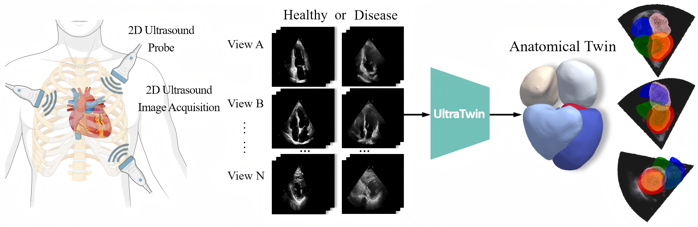

# UltraTwin  
We introduce a novel generative framework named UltraTwin, to obtain accurate 3D Cardiac Anatomical Twin from sparse multi-view 2D US images.  

[Click to play demo](https://jacksonyu-321.github.io/UltraTwin/demo/video.html)  

This work has been accepted by MICCAI2025. You can find the preprint on arXiv: [https://arxiv.org/abs/2506.23490](https://arxiv.org/abs/2506.23490)

## Dataset Availability  
The anonymized multi-view ultrasound-CT paired dataset supporting this work has been released on **Zenodo**.  

- **Link**: [https://doi.org/10.5281/zenodo.15479554](https://goo.su/C0fb1)  
- The dataset includes:  
  - 50 anonymized patient cases with multi-view US images (256×256 pixels, PNG format) and corresponding CT scans (1mm³ isotropic, NIfTI).  

## Code Availability  
We are currently organizing the source code for the UltraTwin framework and will upload it to this repository **as soon as it is ready for public release**.  

- **Planned Content**:  
  - Training scripts for 3D cardiac model reconstruction from multi-view US images.  
  - Model architectures, preprocessing pipelines, and evaluation metrics.  
  - Example notebooks demonstrating dataset usage and inference.  
- **Stay Tuned**:  
  Follow this repository or check the [Zenodo dataset page](https://doi.org/10.5281/zenodo.15479554) for updates. We will announce the code release via a GitHub tag and dataset update.  
